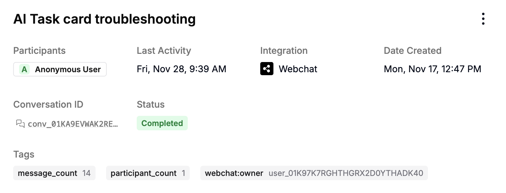
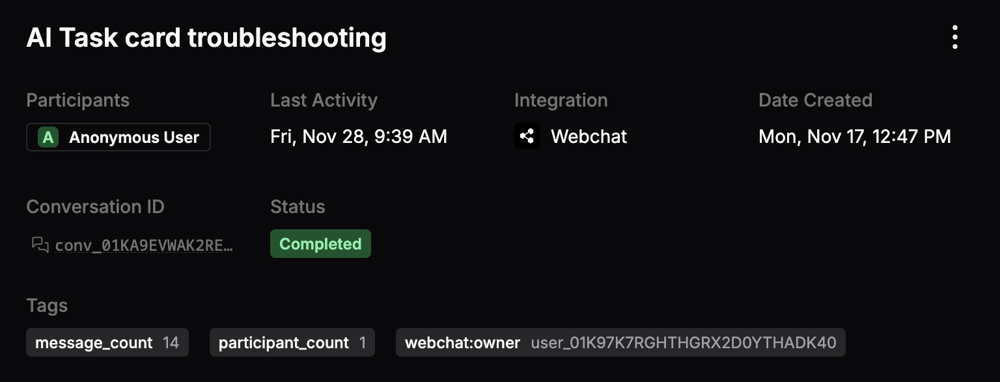
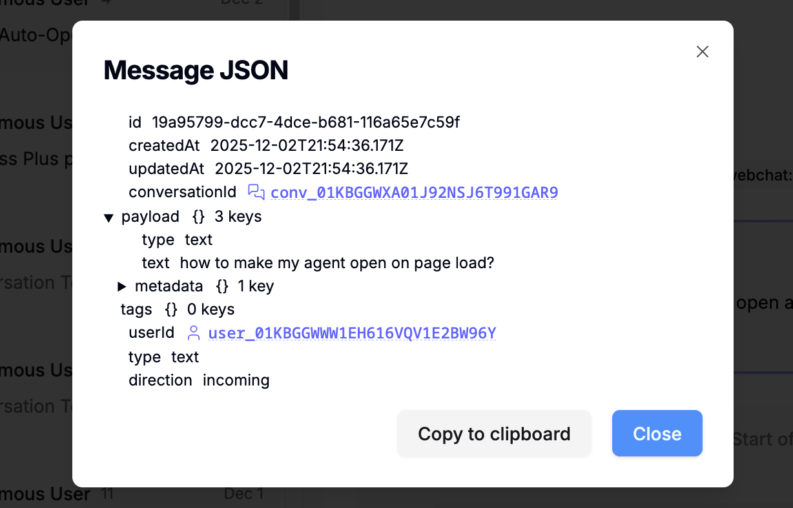
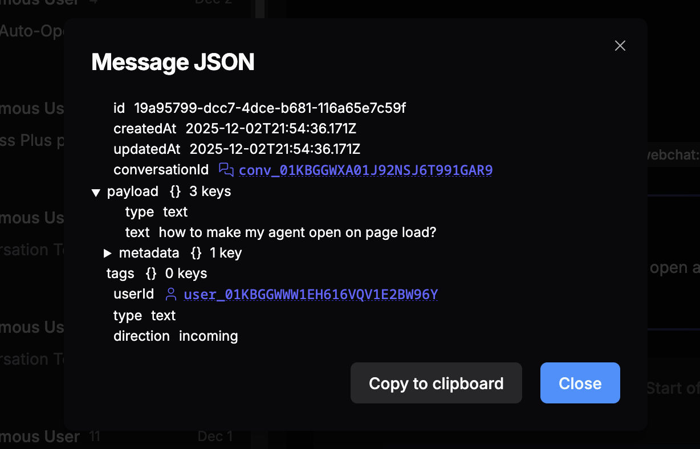
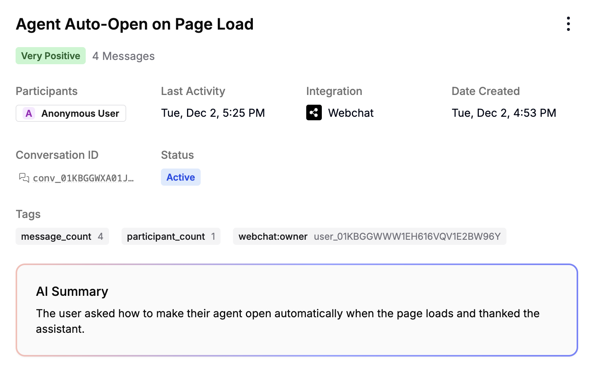
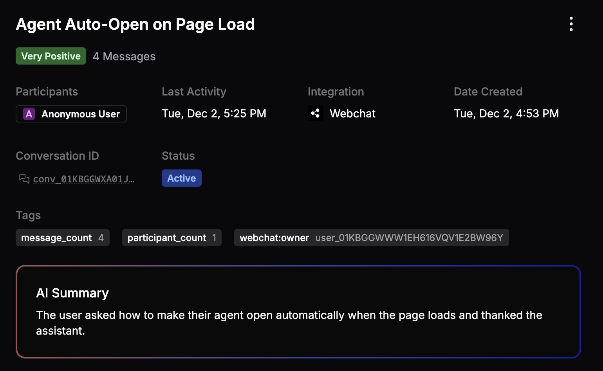
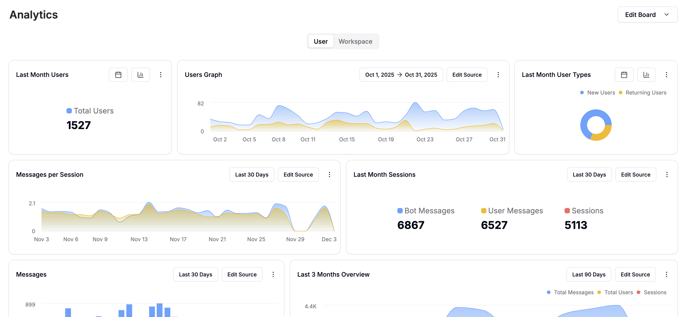
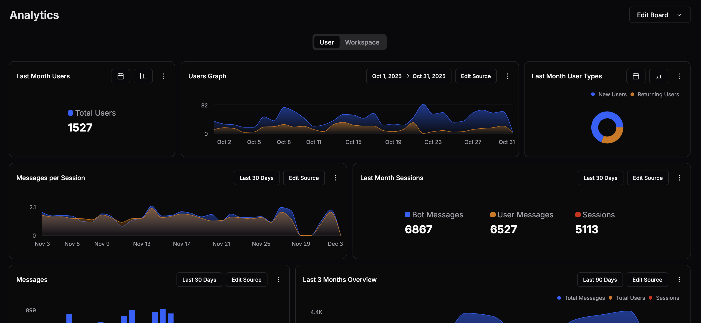

import Icon from '@/components/Icon.astro'
import Frame from '@/components/Frame.astro'
import { Badge } from '@/components/ui/badge'

You can monitor your agent's performance in the **<Icon icon="ChartSpline"/> Monitor** section of your agent's menu. Here's a breakdown of each sub-section:

## Conversations

You can view a list of all your agent's conversations in the **Conversations** sub-section. Just select any conversation to view its details:

<Frame>
  
  
</Frame>

In this menu, you can access:

- The conversation's participants
- Its conversation ID
- Which integration it occurred on
- Its start date and last activity
- Its current status
- Any tags associated with it

### Message data

You can select any message in the conversation to get a detailed JSON representation of all its associated data:

<Frame>
  
  
</Frame>

### AI insights {<Badge variant="deprecated">BETA</Badge>}

Select **<Icon icon="Sparkles"/> Enable AI** to enable sentiment analysis and AI summaries for incoming conversations:

<Frame>
  
  
</Frame>

---

## Users

You can view all your agent's unique users in the **Users** sub-section. Select any user ID to open [conversations](#conversations), [events](/get-started/manage-your-agent/inspect#events), or [logs](/get-started/manage-your-agent/inspect#logs) associated with that user.

## Analytics

You can view detailed analytics about your agent's performance in the **Analytics** sub-section:

<Frame>
  
  
</Frame>

For any tile, you can:

- Select the current range <Icon icon="Calendar"/> to modify it
- Select **Edit Source** <Icon icon="ChartColumn"/> to change which data the tile displays
- Select <Icon icon="EllipsisVertical"/> to access additional options:
  - **Show/Hide Legend**
  - **Type**
  - **Duplicate**
  - **Delete**
